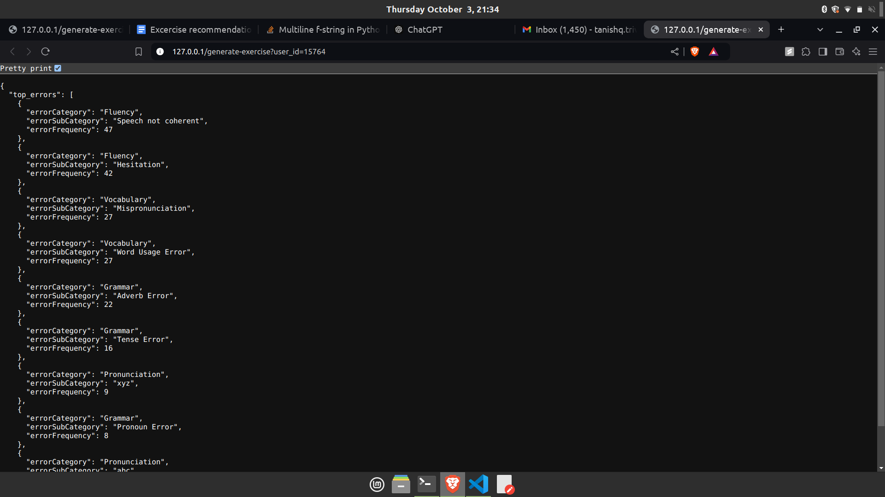

Run following command:
```
docker compose up --build
```

Go to:

[http://127.0.0.1/generate-exercise?user_id=15764](http://127.0.0.1/generate-exercise?user_id=15764)


## Project Structure
1. init.sql - contains records for 100K users
2. config.py - can be used to change value of N, also contains database url (currently uses postgres running in a container)
3. database.py - setting up db connection
4. main.py - code for handling route /generate-exercise
5. Dockerfile
6. docker-compose.yml

